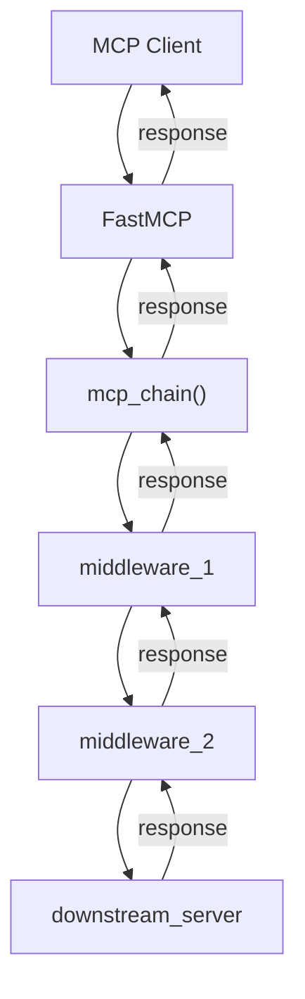

# MCP Chain

A composable middleware framework for building MCP server chains, inspired by Ruby Rack. MCP Chain lets you create transparent proxies that sit between MCP clients and servers, transforming requests and responses using Python functions.

MCP Chain solves the problem of adding cross-cutting concerns (authentication, logging, request transformation) to existing MCP servers without modifying them. It uses a transparent proxy pattern where each middleware layer appears as a standard MCP server to clients while forwarding requests to downstream servers. Middleware can also orchestrate multiple MCP calls behind the scenes using AI, transforming granular APIs into intelligent MCPs that perform complex multi-step tasks.

## Quickstart

Install and run with `uvx` - no setup required:

```python
# cli_server.py
from mcp_chain import mcp_chain, CLIMCPServer

cli_server = CLIMCPServer(
    name="dev-tools",
    commands=["git", "ls", "grep"],
    descriptions={
        "git": "Git version control operations",
        "ls": "List directory contents", 
        "grep": "Search text patterns"
    }
)

# Auto-detected by CLI
chain = mcp_chain().then(cli_server)
```

```bash
uvx mcp-chain cli_server.py
```

Add to your `mcp.json`:
```json
{
  "mcpServers": {
    "dev-tools": {
      "command": "uvx",
      "args": ["mcp-chain", "cli_server.py"]
    }
  }
}
```

## Examples

### Authentication Middleware

Add authentication to any MCP server:

```python
from mcp_chain import mcp_chain, ExternalMCPServer, serve

def require_auth(next_server, request_dict):
    if not request_dict.get("auth_token"):
        return {"error": "Authentication required", "code": 401}
    return next_server.handle_request(request_dict)

chain = (mcp_chain()
         .then(None, require_auth)
         .then(ExternalMCPServer("postgres", "postgres-mcp")))

serve(chain, name="Authenticated Postgres")
```

### Request/Response Transformation

Transform metadata and requests:

```python
from mcp_chain import mcp_chain, CLIMCPServer

def add_company_context(next_server, metadata_dict):
    metadata = next_server.get_metadata()
    for tool in metadata.get("tools", []):
        tool["description"] = f"ACME Corp: {tool.get('description', '')}"
    return metadata

def add_headers(next_server, request_dict):
    request_dict["headers"] = {"X-Company": "ACME"}
    response = next_server.handle_request(request_dict)
    response["processed_by"] = "acme-proxy"
    return response

cli_server = CLIMCPServer(name="tools", commands=["git", "docker"])

chain = (mcp_chain()
         .then(add_company_context, add_headers)
         .then(cli_server))
```

### Multiple Middleware Chain

Stack authentication, logging, and transformation:

```python
import logging
from mcp_chain import mcp_chain, ExternalMCPServer, serve

logging.basicConfig(level=logging.INFO)
logger = logging.getLogger("mcp-chain")

def auth_middleware(next_server, request_dict):
    if not request_dict.get("auth_token"):
        return {"error": "Authentication required", "code": 401}
    return next_server.handle_request(request_dict)

def logging_middleware(next_server, request_dict):
    logger.info(f"Request: {request_dict.get('method')}")
    response = next_server.handle_request(request_dict)
    logger.info(f"Response: {response.get('result', 'error')}")
    return response

def context_middleware(next_server, metadata_dict):
    metadata = next_server.get_metadata()
    for tool in metadata.get("tools", []):
        tool["description"] = f"Enterprise: {tool.get('description', '')}"
    return metadata

chain = (mcp_chain()
         .then(context_middleware, auth_middleware)
         .then(None, logging_middleware)
         .then(ExternalMCPServer("postgres", "postgres-mcp")))

serve(chain, name="Enterprise Postgres")
```

### Programmatic Usage

Use the `serve()` function directly:

```python
from mcp_chain import mcp_chain, CLIMCPServer, serve

def rate_limit_middleware(next_server, request_dict):
    # Add rate limiting logic
    return next_server.handle_request(request_dict)

cli_server = CLIMCPServer(name="secure-tools", commands=["git"])
chain = mcp_chain().then(None, rate_limit_middleware).then(cli_server)

serve(chain, name="Rate Limited Tools", port=8000)
```

## Architecture

MCP Chain uses a functional middleware pattern where each layer transforms requests/responses and forwards to the next layer:



Each middleware layer:
1. Receives requests from the previous layer (or client)
2. Transforms the request/metadata using Python dictionaries
3. Forwards to the next layer (or downstream server)
4. Receives the response back
5. Transforms the response as needed
6. Returns to the previous layer (or client)

**Core Principles:**
- **Transparent Proxy**: Each middleware appears as a standard MCP server to clients
- **Dict-Based Processing**: Internal processing uses Python dicts, not JSON strings
- **Composable**: Middleware can chain together since each layer is an MCP server
- **Zero Overhead**: No serialization/deserialization in the middleware chain

Built on the official FastMCP SDK for complete MCP protocol compliance.

## API

### Core Functions

```python
from mcp_chain import mcp_chain, serve, CLIMCPServer, ExternalMCPServer

# Create a chain
chain = mcp_chain()

# Add middleware layers
chain = chain.then(metadata_transformer, request_transformer)
chain = chain.then(downstream_server)

# Start server
serve(chain, name="My Server", port=8000)
```

### Chain Building

```python
# Metadata transformer (transforms server capabilities)
def metadata_transformer(next_server, metadata_dict):
    metadata = next_server.get_metadata()
    # Transform metadata dict and return
    return metadata

# Request transformer (transforms requests/responses)  
def request_transformer(next_server, request_dict):
    # Transform request dict
    response = next_server.handle_request(request_dict)
    # Transform response dict and return
    return response

# Add to chain
chain = mcp_chain().then(metadata_transformer, request_transformer)
```

### Built-in Servers

```python
# CLI server - exposes command-line tools as MCP tools
cli_server = CLIMCPServer(
    name="my-tools",
    commands=["git", "docker", "npm"],
    descriptions={
        "git": "Git operations",
        "docker": "Container management",
        "npm": "Package management"
    }
)

# External server proxy
external_server = ExternalMCPServer("server-name", "command-to-run")
```

### Auto-Detection

The CLI automatically detects chain variables in your Python files:

```python
# Any of these variable names work:
chain = mcp_chain().then(...)
my_chain = mcp_chain().then(...)  
server_chain = mcp_chain().then(...)
proxy = mcp_chain().then(...)
```

Run with: `uvx mcp-chain filename.py`

## Development

This project was developed primarily using AI assistants and is designed for AI-assisted development workflows. The codebase is structured to be easily understood and modified by AI tools. The `ai/` folder contains context documents and design notes specifically for AI assistants working on this repository.

### Installation

```bash
# Development install
git clone https://github.com/ronie-uliana/mcp-chain
cd mcp-chain
uv sync
```

### Testing

```bash
# Fast unit tests
uv run pytest tests/ -m "not integration" -v

# Integration tests (with timeout protection)
timeout 30 uv run pytest tests/ -m integration -v

# All tests
timeout 45 uv run pytest tests/ -v

# Local CI pipeline
./scripts/test-ci.sh
```

**Test Coverage**: 146 tests total (141 unit/component tests, 5 integration tests)

### Publishing

```bash
uv build && uv publish
```

Releases are automatically published to PyPI via GitHub Actions on new releases.

## Installation Options

```bash
# Recommended: Run with uvx (no installation)
uvx mcp-chain my_chain.py

# Install from PyPI
pip install mcp-chain

# Run installed version
python -m mcp_chain my_chain.py
# or
mcp-chain my_chain.py
```