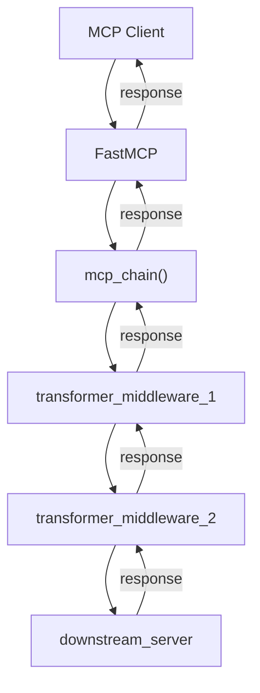

# MCP Chain

A composable middleware framework for building sophisticated MCP server chains inspired by Ruby Rack.

## 🚀 Quickstart

Get started in 30 seconds with `uvx` - no installation required!

### Simple CLI Server

Create a CLI server that exposes command-line tools as MCP tools:

```python
# cli_server.py
from mcp_chain import mcp_chain, CLIMCPServer

# Create a CLI server for the ls command
cli_server = CLIMCPServer(
    name="ls-tool",
    commands=["ls"],
    descriptions={
        "ls": "List files and directories in the current path with detailed information"
    }
)

# Create the chain - auto-detected by mcp-chain CLI
chain = mcp_chain().then(cli_server)
```

```bash
uvx mcp-chain cli_server.py
```

### Multi-Command CLI Server

Create a server that exposes multiple CLI tools:

```python
# dev_tools.py
from mcp_chain import mcp_chain, CLIMCPServer

# Create a CLI server with multiple development tools
dev_tools = CLIMCPServer(
    name="dev-tools-server",
    commands=["git", "docker", "npm", "grep"],
    descriptions={
        "git": "Git version control operations for project management",
        "docker": "Docker container management and deployment tools", 
        "npm": "Node.js package management and build automation",
        "grep": "Text search and pattern matching utility"
    }
)

# Create the chain - auto-detected by mcp-chain CLI
chain = mcp_chain().then(dev_tools)
```

```bash
uvx mcp-chain dev_tools.py
```

### Simple Proxy

Create a simple proxy to an existing MCP server:

```python
# simple_proxy.py
from mcp_chain import mcp_chain, ExternalMCPServer, serve

chain = mcp_chain().then(ExternalMCPServer("postgres", "postgres-mcp"))
serve(chain, name="Postgres Proxy")
```

```bash
uvx mcp-chain simple_proxy.py
```

### Add Authentication

Add authentication middleware to any MCP server:

```python
# auth_proxy.py
from mcp_chain import mcp_chain, ExternalMCPServer, serve

def require_auth(next_server, request_dict):
    if not request_dict.get("auth_token"):
        return {"error": "Authentication required", "code": 401}
    return next_server.handle_request(request_dict)

chain = (mcp_chain()
         .then(None, require_auth)  # None = no metadata transformer
         .then(ExternalMCPServer("postgres", "postgres-mcp")))
 
serve(chain, name="Authenticated Postgres")
```

```bash
uvx mcp-chain auth_proxy.py
```

### CLI Server with Authentication

Add authentication to a CLI server:

```python
# auth_cli.py
from mcp_chain import mcp_chain, CLIMCPServer

def require_auth(next_server, request_dict):
    if not request_dict.get("auth_token"):
        return {"error": "Authentication required", "code": 401}
    return next_server.handle_request(request_dict)

cli_server = CLIMCPServer(name="secure-ls", commands=["ls"])

# Chain with auth middleware - auto-detected by mcp-chain CLI
chain = (mcp_chain()
         .then(None, require_auth)
         .then(cli_server))
```

```bash
uvx mcp-chain auth_cli.py
```

### Add Request Logging

Log all requests and responses:

```python
# logging_proxy.py
from mcp_chain import mcp_chain, ExternalMCPServer, serve
import logging

logging.basicConfig(level=logging.INFO)
logger = logging.getLogger("mcp-proxy")

def log_requests(next_server, request_dict):
    logger.info(f"Request: {request_dict.get('method', 'unknown')}")
    response = next_server.handle_request(request_dict)
    logger.info(f"Response: {response.get('result', response.get('error'))}")
    return response

chain = (mcp_chain()
         .then(None, log_requests)
         .then(ExternalMCPServer("postgres", "postgres-mcp")))

serve(chain, name="Logged Postgres")
```

```bash
uvx mcp-chain logging_proxy.py
```

### Transform Tool Descriptions

Make generic tools company-specific:

```python
# company_proxy.py
from mcp_chain import mcp_chain, ExternalMCPServer, serve

def add_company_context(next_server, metadata_dict):
    metadata = next_server.get_metadata()
    for tool in metadata.get("tools", []):
        tool["description"] = f"ACME Corp: {tool.get('description', '')}"
    return metadata

chain = (mcp_chain()
         .then(add_company_context, None)  # None = no request transformer  
         .then(ExternalMCPServer("postgres", "postgres-mcp")))

serve(chain, name="ACME Postgres")
```

```bash
uvx mcp-chain company_proxy.py
```

### Chain Multiple Middlewares

Stack authentication, logging, and context enrichment:

```python
# full_proxy.py
from mcp_chain import mcp_chain, ExternalMCPServer, serve
import logging

logging.basicConfig(level=logging.INFO)
logger = logging.getLogger("mcp-proxy")

def add_company_context(next_server, metadata_dict):
    metadata = next_server.get_metadata()
    for tool in metadata.get("tools", []):
        tool["description"] = f"ACME Corp: {tool.get('description', '')}"
    return metadata

def auth_and_log(next_server, request_dict):
    # Auth check
    if not request_dict.get("auth_token"):
        return {"error": "Authentication required", "code": 401}
    
    # Log request
    logger.info(f"Authenticated request: {request_dict.get('method')}")
    
    # Forward and log response
    response = next_server.handle_request(request_dict)
    logger.info(f"Response: {response.get('result', response.get('error'))}")
    
    return response

chain = (mcp_chain()
         .then(add_company_context, auth_and_log)
         .then(ExternalMCPServer("postgres", "postgres-mcp")))

serve(chain, name="Full-Stack ACME Postgres")
```

```bash
uvx mcp-chain full_proxy.py
```

### Auto-Detection Magic 🪄

The CLI auto-detects your chain - any of these variable names work:

```python
# Any of these work:
chain = mcp_chain().then(...)
my_chain = mcp_chain().then(...)  
server_chain = mcp_chain().then(...)
proxy = mcp_chain().then(...)
```

**That's it!** Create a Python file with a chain definition and run it with `uvx mcp-chain filename.py`. No installation, no setup, no boilerplate.

### Installation

For production use, the preferred method is to run your chain definition file directly with:

```bash
uvx mcp-chain my_chain.py
```

For development, you can install MCP Chain directly:

```bash
# Install for development
git clone https://github.com/ronie-uliana/mcp-chain
cd mcp-chain
uv sync
```

## PyPI & CLI Usage

Install from PyPI:

```bash
pip install mcp-chain
```

Run a chain definition file:

```bash
uvx mcp-chain my_chain.py
# or
python -m mcp_chain my_chain.py
# or
mcp-chain my_chain.py
```

## FastMCP Integration Benefits 🚀

MCP Chain is now powered by the official [FastMCP](https://python-sdk.docs.modelcontextprotocol.io/) framework, providing:

### **🏎️ High Performance**
- **Zero JSON Overhead**: Internal processing uses Python dictionaries instead of JSON serialization/deserialization
- **Efficient Protocol Handling**: Built on the official MCP SDK for optimal client communication
- **Streaming Support**: Full support for MCP streaming capabilities where available

### **🔒 Full Protocol Compliance**
- **Official MCP SDK**: Uses the same SDK that powers other production MCP servers
- **Complete MCP Support**: Tools, resources, prompts, sampling, and all protocol features
- **Transport Agnostic**: Works with STDIO, HTTP, and any transport supported by FastMCP

### **🧩 Seamless Integration**
- **Decorator-Style API**: Internally converts your middleware to FastMCP's decorator pattern
- **Dynamic Registration**: Tools and resources are automatically discovered from your middleware chain
- **Type Safety**: Full type annotations for better development experience

### **🛡️ Production-Ready Features**
- **Comprehensive Error Handling**: Robust error handling for all failure modes
- **Detailed Logging**: Warning and error logging throughout the system
- **Duplicate Detection**: Prevents duplicate tool/resource registration
- **Malformed Data Handling**: Graceful handling of invalid metadata
- **Test Coverage**: 141 tests passing, covering all functionality

### **🎯 Simple Migration**
Existing middleware continues to work unchanged:

```python
# Your existing middleware works as-is
def my_middleware(next_server, request_dict):
    # Transform request
    response = next_server.handle_request(request_dict)
    # Transform response
    return response

# Just add serve() to start the server
from mcp_chain import serve
serve(my_chain, name="My Server")
```

## Programmatic Usage

You can also use the `serve()` function directly in your Python programs:

```python
from mcp_chain import mcp_chain, ExternalMCPServer, CLIMCPServer, serve

def auth_middleware(next_server, request_dict):
    # Add your authentication logic
    if not request_dict.get("auth_token"):
        return {"error": "Authentication required", "code": 401}
    return next_server.handle_request(request_dict)

# Option 1: Chain with external MCP server
chain = (mcp_chain()
         .then(None, auth_middleware)
         .then(ExternalMCPServer("postgres", "postgres-mcp")))

# Option 2: Chain with CLI server
cli_server = CLIMCPServer(name="secure-git", commands=["git"])
cli_chain = (mcp_chain()
            .then(None, auth_middleware)
            .then(cli_server))

# Start server programmatically 
serve(chain, name="Authenticated Postgres", port=8000)
# or
serve(cli_chain, name="Authenticated Git Tools", port=8001)
```

## Detailed Usage

```python
from mcp_chain import mcp_chain, CLIMCPServer, serve

# Create middleware functions that work with Python dictionaries
def add_auth_header(next_server, request_dict):
    # Transform the incoming request by adding auth header
    request_dict["headers"] = {"Authorization": "Bearer token123"}
    
    # Forward the modified request to next server and return response
    response = next_server.handle_request(request_dict)
    # Could modify response here if needed
    return response

def add_company_context(next_server, metadata_dict):
    # Get metadata from downstream MCP server
    metadata = next_server.get_metadata()
    # Transform the metadata by adding company context
    for tool in metadata.get("tools", []):
        tool["description"] = f"Company Tool: {tool.get('description', '')}"
    return metadata

# Create a CLI server as the downstream server
cli_server = CLIMCPServer(
    name="company-tools",
    commands=["git", "npm", "docker"],
    descriptions={
        "git": "Version control operations",
        "npm": "Package management",
        "docker": "Container management"
    }
)

# Build the chain: client → transformers → CLI server
chain = (mcp_chain()
         .then(add_company_context, add_auth_header)
         .then(cli_server))

# Option A: Auto-detection (save as company_tools.py, run with uvx mcp-chain company_tools.py)
# The 'chain' variable will be auto-detected

# Option B: Programmatic serving
serve(chain, name="Company MCP Server")
```

## Core Concepts

1. **Transparent MCP Proxy** - Each middleware appears as a standard MCP server to clients, but forwards requests to downstream MCP servers
2. **Dict-Based Processing** - All internal processing uses Python dictionaries instead of JSON strings for maximum performance
3. **Request/Response Transformation** - Middleware can modify MCP messages in both directions (client→server and server→client)
4. **Metadata Manipulation** - Can alter tool descriptions, server capabilities, resource listings, and other MCP metadata
5. **Full MCP Compliance** - Built on the official FastMCP SDK for complete protocol support
6. **Composable Architecture** - Middleware can chain together since each middleware is just another MCP server

## Architecture

MCP Chain uses a functional middleware approach powered by FastMCP where each layer in the chain:

1. **Receives** requests from the previous layer (or client)
2. **Transforms** the request/metadata as needed (using Python dicts)
3. **Forwards** to the next layer (or downstream server)
4. **Receives** the response back
5. **Transforms** the response as needed
6. **Returns** to the previous layer (or client)



**Key Benefits:**
- **Zero JSON Overhead**: FastMCP handles client protocol, middleware uses Python dicts internally
- **Official Compliance**: Built on the official MCP SDK for guaranteed protocol compliance
- **High Performance**: No serialization/deserialization in the middleware chain
- **Production Ready**: Comprehensive error handling and logging

## Current Implementation

### ✅ Implemented Features

- **FastMCP Integration** - Built on the official MCP SDK for full protocol compliance
- **Core chaining infrastructure** - `mcp_chain()` factory and `then()` method
- **Dict-based transformers** - Functions that work directly with Python dictionaries
- **Metadata transformation** - Modify tool descriptions, capabilities, etc.
- **Request/response transformation** - Modify requests and responses in both directions
- **Dynamic registration** - Tools and resources automatically registered from metadata
- **Error handling** - Proper errors when no downstream server is configured
- **Type safety** - Full type annotations with DictMCPServer protocol
- **serve() function** - Easy programmatic server startup
- **CLIMCPServer** - Built-in server for exposing CLI commands as MCP tools
- **Multi-command support** - Single server can expose multiple CLI commands
- **Auto-detection** - CLI automatically detects chain variables in your Python files
- **Comprehensive error handling** - Robust error handling for all failure modes
- **Detailed logging** - Warning and error logging throughout the system
- **Duplicate detection** - Prevents duplicate tool/resource registration
- **Malformed data handling** - Graceful handling of invalid metadata
- **Full test coverage** - 141 tests passing, covering all functionality

### 🚀 Current API

```python
# CLIMCPServer - expose CLI commands as MCP tools
from mcp_chain import mcp_chain, CLIMCPServer

# CLI server with single command
cli_server = CLIMCPServer(
    name="my-tool",
    commands=["ls"],
    descriptions={
        "ls": "List directory contents"
    }
)

# CLI server with multiple commands
multi_cli = CLIMCPServer(
    name="dev-tools",
    commands=["git", "docker", "npm"],
    descriptions={
        "git": "Git version control operations",
        "docker": "Docker container management",
        "npm": "Node.js package management"
    }
)

# Dict-based transformers (work with Python dictionaries)
def metadata_transformer(next_server, metadata_dict):
    # Get metadata from downstream and transform it
    metadata = next_server.get_metadata()
    # Transform and return (Python dict, no JSON)
    for tool in metadata.get("tools", []):
        tool["description"] = f"Enhanced: {tool.get('description', '')}"
    return metadata

def request_transformer(next_server, request_dict):
    # Transform request (Python dict)
    request_dict["enhanced"] = True
    
    # Forward request to downstream and get response
    response = next_server.handle_request(request_dict)
    
    # Transform response and return (Python dict)
    response["processed"] = True
    return response

# Chain building options:

# 1. Auto-detected by CLI (no serve() call needed)
chain = mcp_chain().then(cli_server)

# 2. With middleware transformers (auto-detected)
chain = (mcp_chain()
         .then(metadata_transformer, request_transformer)
         .then(cli_server))

# 3. Programmatic serving with serve() function
chain = (mcp_chain()
         .then(metadata_transformer, request_transformer)
         .then(downstream_server))
serve(chain, name="Enhanced MCP Server")
```

## Use Cases

- **Authentication Middleware** - Add authentication/authorization before forwarding to downstream servers
- **Logging/Monitoring Middleware** - Track and analyze all MCP interactions
- **Tool Filtering Middleware** - Hide/expose certain tools based on context or permissions  
- **Response Caching Middleware** - Cache expensive tool calls for better performance
- **Rate Limiting Middleware** - Throttle requests to protect downstream servers
- **Tool Composition Middleware** - Combine multiple downstream servers into a unified interface
- **Context Enrichment Middleware** - Transform generic MCPs into specific, context-aware MCPs

### Context Enrichment Example

A powerful pattern is transforming generic MCP servers into domain-specific ones through context enrichment:

```
Client → Context Enrichment Middleware → Generic Postgres MCP Server
```

The middleware can:
- Intercept requests to the generic Postgres MCP
- Enrich them with company-specific database metadata, schemas, and business context
- Transform tool descriptions to be company-specific (e.g., "Query the customer database" instead of "Execute SQL query")
- Add relevant context about tables, relationships, and business rules
- Filter available operations based on user permissions

This turns a generic `postgres-mcp` into a `company-database-mcp` without modifying the underlying server.

### Composable Chains

Since each middleware is a compliant MCP server, you can stack them arbitrarily:

```
Client → Auth → Logging → RateLimit → Cache → ContextEnrichment → PostgresMCP
```

Each middleware in the chain can transform the requests and responses as needed, creating powerful, reusable building blocks for MCP server functionality.

## Production Features ✅

### **Error Handling & Logging**
- **Metadata Retrieval Failures**: Catches and logs metadata retrieval errors
- **Empty Metadata Warning**: Logs when no tools/resources are found  
- **Duplicate Detection**: Prevents duplicate tool/resource registration with warnings
- **Malformed Data Handling**: Gracefully handles invalid tool/resource metadata
- **FastMCP Initialization Failures**: Proper error propagation for FastMCP setup issues


### **Performance & Reliability**
- **Zero JSON Overhead**: Dict-based internal processing
- **Official Protocol Compliance**: Built on FastMCP SDK
- **Type Safety**: Complete type annotations throughout
- **Developer Experience**: Clear error messages and comprehensive debugging

## Development

This project was built using Test-Driven Development (TDD). 

### Running Tests

#### Unit and Component Tests
For fast feedback during development, run the standard test suite:

```bash
uv run pytest tests/ -v
```

#### Integration Tests  
For comprehensive end-to-end testing, run integration tests **with timeout protection**:

```bash
# Run all integration tests (recommended timeout: 30s)
timeout 30 uv run pytest tests/ -m integration -v

# Run specific integration test
timeout 30 uv run pytest tests/test_mcp_protocol_integration.py::test_mcp_protocol_complete_flow -v

# Run with live output (useful for debugging)
timeout 30 uv run pytest tests/ -m integration -v -s
```

#### Excluding Integration Tests
For CI or when you want fast test runs, exclude integration tests:

```bash
# Run all tests except integration tests
uv run pytest tests/ -m "not integration" -v
```

#### Complete Test Coverage
Run both unit and integration tests:

```bash
# Run all tests (unit + integration) with timeout protection
timeout 45 uv run pytest tests/ -v
```

#### Local CI Pipeline
Test the complete CI pipeline locally before pushing:

```bash
# Run the complete CI pipeline locally (mirrors GitHub Actions)
./scripts/test-ci.sh
```

### Test Organization

- **Unit/Component Tests**: Fast tests (< 1s each) that don't require external processes
- **Integration Tests**: End-to-end tests that start real MCP servers and test the complete protocol flow
  - Located in `tests/test_mcp_protocol_integration.py`
  - Marked with `@pytest.mark.integration`
  - Require timeout protection due to subprocess management
  - Test MCP protocol compliance, tool discovery, execution, and middleware logging

Currently **146 total tests** are passing:
- **141 unit/component tests** - Fast development feedback
- **5 integration tests** - End-to-end protocol validation

Comprehensive coverage includes:
- FastMCP integration and protocol compliance
- Error handling scenarios and edge cases
- Middleware functionality and chaining
- Type safety validation
- CLI tool integration
- Complete MCP protocol flow validation

## See Also

- [Design Document](design.md) - Detailed architecture and implementation notes
- [Tests](tests/) - Comprehensive test suite showing usage patterns

## CI/CD with GitHub Actions

Our CI pipeline ensures code quality and reliability across multiple platforms:

### Continuous Integration (CI)
- **Multi-platform testing**: Tests run on Ubuntu, macOS, and Windows
- **Multi-version testing**: Python 3.12 and 3.13 support
- **Fast unit tests**: Run on every push/PR for quick feedback
- **Integration tests**: Full MCP protocol validation with timeout protection
- **Code formatting**: Automated linting with ruff
- **Coverage reporting**: Code coverage tracked and reported

### Test Strategy in CI
```bash
# Unit/Component tests (fast, always run)
uv run pytest tests/ -m "not integration" -v

# Integration tests (comprehensive, with timeout protection)  
timeout 45 uv run pytest tests/ -m integration -v
```

### Automated Publishing
- Releases are automatically published to PyPI when GitHub releases are created
- Trusted publishing with OpenID Connect (no API keys required)
- Pre-publish test validation ensures only working code is released

See [.github/workflows/](.github/workflows/) for complete workflow definitions.

## Publishing to PyPI

To build and upload manually:

```bash
uv build && uv publish
```

Publishing is also automated via GitHub Actions on new releases (see .github/workflows/publish.yml).