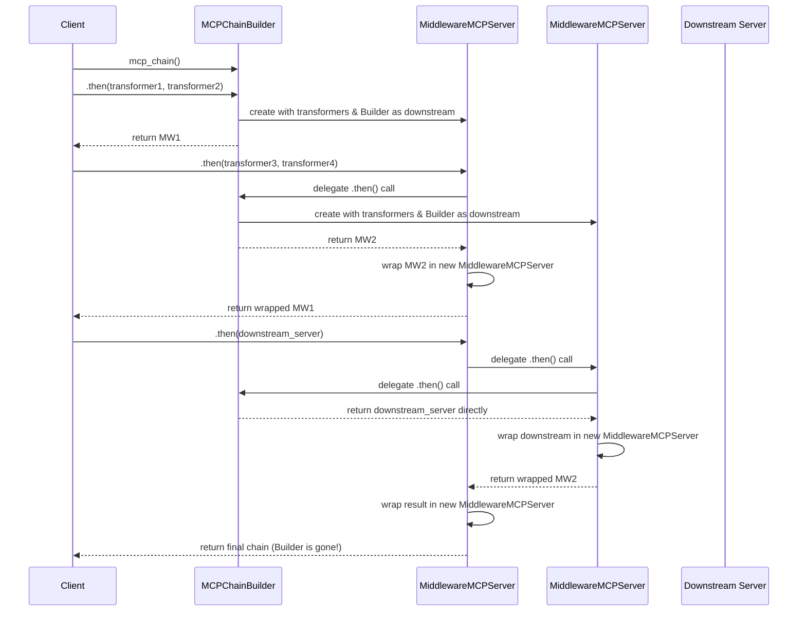

# MCP Chain Architecture Design

## Vision

MCP Chain provides a **middleware MCP server** architecture that acts as a transparent proxy between MCP clients and downstream MCP servers, while being itself a fully compliant MCP server.

## Recent Major Changes (v2.0 Architecture)

### ✅ **Completed Refactoring**

1. **Renamed DummyMCPServer → MCPChainBuilder** - Clear builder pattern separation
2. **Two-Phase Architecture** - Clean separation between chain building and runtime execution  
3. **Smart Argument Detection** - MCPChainBuilder handles transformer vs server detection
4. **Delegating MiddlewareMCPServer** - Simplified delegation pattern with error handling
5. **No Backward Compatibility** - Clean architecture without legacy cruft

### 🏗️ **Key Architectural Changes**

- **mcp_chain()** now returns **MCPChainBuilder** (not MiddlewareMCPServer)
- **MCPChainBuilder** exists only during chain construction and gets completely replaced
- **MiddlewareMCPServer.then()** now just delegates to child and wraps result
- **Error handling** when trying to chain on servers without `then` method
- **Execution order** is now first-added-transformer-outermost (not last-added-outermost)

## Design Philosophy

### Core Principles

1. **Transparent Proxy** - Each middleware appears as a standard MCP server to clients
2. **Functional Composition** - Middleware can be composed using a clean chaining API
3. **Request/Response Transformation** - Modify MCP messages in both directions
4. **Type Safety** - Full type annotations for better developer experience
5. **Test-Driven** - Built using strict TDD methodology
6. **Builder Pattern** - Clean separation between chain building and runtime execution

### Architecture Overview

```
Client → MCPChainBuilder → MiddlewareMCPServer → MiddlewareMCPServer → downstream_server
                       ↑                     ↑                     ↓
                       ← ← ← ← ← ← ← ← ← ← ← ← ← ← ← response ← ← ← ←
```

MCP Chain uses a **two-phase architecture**:

#### Phase 1: Chain Building (MCPChainBuilder)
- **MCPChainBuilder** exists only during chain construction
- Handles argument detection and smart `then()` logic
- Gets completely replaced when real downstream server is added
- Should never process actual MCP requests (throws errors if accessed)

#### Phase 2: Runtime Execution (MiddlewareMCPServer)
- **MiddlewareMCPServer** handles runtime request/response processing
- Agnostic about child types - just delegates and wraps
- Each middleware layer transforms requests/responses as needed
- Forms the actual execution chain after building is complete

## Usage Patterns

### Basic Chain Construction

```python
from mcp_chain import mcp_chain

# Build a simple chain
chain = (mcp_chain()
         .then(metadata_transformer, request_transformer)  # Add transformers
         .then(downstream_server))                         # Add downstream server

# Use like any MCP server
metadata = chain.get_metadata()
response = chain.handle_request('{"method": "tools/call", ...}')
```

### Common Use Cases

#### 1. Context Enrichment
Transform generic MCP servers into domain-specific ones:

```python
def add_company_context(next_mcp, json_metadata: str) -> str:
    # Get metadata from downstream
    original_metadata = next_mcp.get_metadata()
    metadata = json.loads(original_metadata)
    for tool in metadata.get("tools", []):
        tool["description"] = f"Company Database: {tool['description']}"
    return json.dumps(metadata)

# Transform generic postgres-mcp into company-database-mcp
chain = mcp_chain().then(add_company_context, identity_transformer).then(postgres_server)
```

#### 2. Authentication & Authorization
Add security layers without modifying downstream servers:

```python
def add_auth_headers(next_mcp, json_request: str) -> str:
    request = json.loads(json_request)
    request["headers"] = {"Authorization": f"Bearer {get_token()}"}
    
    # Forward authenticated request to downstream and return response
    return next_mcp.handle_request(json.dumps(request))

chain = mcp_chain().then(lambda x: x, add_auth_headers).then(protected_server)
```

#### 3. Request/Response Logging
Monitor all MCP interactions:

```python
def log_requests(next_mcp, json_request: str) -> str:
    logger.info(f"MCP Request: {json_request}")
    
    # Forward request to downstream
    response = next_mcp.handle_request(json_request)
    
    # Log and return response
    logger.info(f"MCP Response: {response}")
    return response

chain = mcp_chain().then(lambda x: x, log_requests).then(server)
```

#### 4. Multi-Layer Chains
Compose multiple middleware layers:

```python
chain = (mcp_chain()
         .then(auth_middleware)           # Add authentication
         .then(logging_middleware)        # Add logging
         .then(context_middleware)        # Add context
         .then(downstream_server))        # Connect to actual server
```

## Current Implementation Status

### ✅ Implemented Features

- **MCPChainBuilder pattern** - Clean separation of chain building from runtime execution
- **Smart argument detection** - Automatically handles transformers vs downstream servers
- **Delegating MiddlewareMCPServer** - Agnostic middleware that just delegates and wraps
- **Raw transformer support** (JSON string-based functions)
- **Metadata transformation** for tool descriptions and capabilities
- **Request/response transformation** in both directions  
- **Proper error handling** - No backward compatibility, clean error messages
- **Type safety** with comprehensive type annotations
- **Modular architecture** with clean file separation

### 🔄 Current API

#### Chain Building with MCPChainBuilder

```python
from mcp_chain import mcp_chain

# Start with MCPChainBuilder
builder = mcp_chain()  # Returns MCPChainBuilder

# Add transformers - creates MiddlewareMCPServer with MCPChainBuilder as downstream
middleware = builder.then(metadata_transformer, request_transformer)

# Add downstream server - MCPChainBuilder detects it and returns it directly
final_chain = middleware.then(downstream_server)  # MCPChainBuilder is completely replaced
```

#### MiddlewareMCPServer Delegation

```python
# MiddlewareMCPServer.then() now simply:
# 1. Delegates args to child.then()
# 2. Wraps result in new MiddlewareMCPServer
# 3. Throws error if child has no `then` method

# This creates clean delegation:
# MW1 -> MW2 -> downstream
# MW1.then(x) calls MW2.then(x), wraps result
```

#### Raw Transformers

Raw transformers work directly with JSON strings:

```python
# Metadata transformer
def metadata_transformer(next_mcp, json_metadata: str) -> str:
    # Get metadata from downstream, transform, and return
    # Note: The json_metadata argument can be used to communicate 
    # with downstream middleware, even though get_metadata() doesn't 
    # have arguments in the MCP protocol
    original_metadata = next_mcp.get_metadata()
    return transform(original_metadata)

# Request/response transformer  
def request_transformer(next_mcp, json_request: str) -> str:
    # Transform request 
    transformed_request = transform_request(json_request)
    
    # Forward to downstream and get response
    response = next_mcp.handle_request(transformed_request)
    
    # Transform and return response
    return transform_response(response)
```

## TODO List - Missing Features

### 🎯 High Priority

#### 1. Automatic Transformer Type Detection
**Status**: Not implemented  
**Description**: Implement automatic detection of porcelain vs raw transformers using type hints

```python
# Should auto-detect this is a porcelain transformer
def porcelain_transformer(metadata: Dict[str, Any]) -> Dict[str, Any]:
    return metadata

# Should auto-detect this is a raw transformer  
def raw_transformer(json_metadata: str) -> str:
    return json_metadata

# Implementation needed in middleware.py:
def _is_raw_transformer(self, transformer) -> bool:
    """Detect if transformer is raw by checking type hints"""
    # Use get_type_hints() and inspect.signature()
    pass

def _wrap_metadata_transformer(self, transformer: MetadataTransformer) -> RawMetadataTransformer:
    """Wrap dict-based transformer to work with JSON strings"""
    pass

def _wrap_request_transformer(self, transformer: RequestResponseTransformer) -> RawRequestResponseTransformer:
    """Wrap dict-based transformer to work with JSON strings"""
    pass
```

#### 2. Single-argument `then()` for Request Transformers
**Status**: Not implemented  
**Description**: Support `then(request_transformer)` for request-only transformations

```python
# Should work:
chain = mcp_chain().then(request_only_transformer).then(server)

# Current workaround:
chain = mcp_chain().then(lambda x: x, request_transformer).then(server)
```

#### 3. Enhanced then() Method
**Status**: Partially implemented  
**Description**: Smart `then()` method that auto-detects transformer types

```python
# Should all work automatically:
chain = (mcp_chain()
    .then(dict_metadata_transformer, dict_request_transformer)  # Porcelain
    .then(raw_request_transformer)                              # Raw, request-only
    .then(raw_metadata_transformer, raw_request_transformer)    # Raw, both
    .then(downstream_server))                                   # Server
```

### 🔧 Medium Priority

#### 4. Overloaded then() Method with Type Hints
**Status**: Not implemented  
**Description**: Add proper `@overload` decorators for better IDE support

```python
from typing import overload, Union

@overload
def then(self, downstream: MCPServer) -> 'MiddlewareMCPServer': ...

@overload 
def then(self, transformer: Union[RequestResponseTransformer, RawRequestResponseTransformer]) -> 'MiddlewareMCPServer': ...

@overload
def then(self, metadata_transformer: Union[MetadataTransformer, RawMetadataTransformer], 
         request_transformer: Union[RequestResponseTransformer, RawRequestResponseTransformer]) -> 'MiddlewareMCPServer': ...
```

#### 5. Error Handling Improvements
**Status**: Basic implementation  
**Description**: Better error messages and error recovery

- More descriptive error messages
- Better handling of malformed JSON in transformers
- Graceful fallbacks when transformers fail

#### 6. Logging and Debugging Support
**Status**: Not implemented  
**Description**: Built-in logging for debugging chains

```python
# Enable debug logging
chain = mcp_chain(debug=True)

# Or add logging middleware
chain = mcp_chain().then(logging_middleware).then(server)
```

### 🚀 Low Priority (Future Enhancements)

#### 7. Performance Optimizations
- Connection pooling for downstream servers
- Caching layer for expensive transformations
- Async/await support for concurrent processing

#### 8. Configuration Management
- YAML/JSON configuration files for chains
- Environment variable support
- Dynamic chain reconfiguration

#### 9. Middleware Library
- Pre-built common middleware (auth, logging, caching, rate limiting)
- Plugin system for third-party middleware
- Middleware discovery and registration

#### 10. Advanced Features
- Conditional middleware (route-based)
- Middleware composition helpers
- Chain validation and testing utilities

## Implementation Notes

### Adding Porcelain Transformer Support

The main work for porcelain transformers involves:

1. **Type Detection** - Use `get_type_hints()` to inspect function signatures
2. **Wrapper Functions** - Convert dict-based transformers to JSON string transformers  
3. **Updated then() Method** - Auto-detect and wrap transformers as needed

### Testing Strategy

Continue using TDD for new features:
1. Write failing tests for the desired API
2. Implement minimal functionality to pass tests
3. Refactor and improve while keeping tests green

### Code Organization

The current file structure is clean and should be maintained:
- Keep `__init__.py` minimal with just public API
- Add new functionality to appropriate separate files
- Maintain type safety throughout

## Architecture Diagrams

### Current Implementation (Completed)
```mermaid
graph TD
    subgraph "Public API"
        API[mcp_chain()]
    end
    
    subgraph "Chain Building"
        CB[MCPChainBuilder]
    end
    
    subgraph "Runtime Execution"
        MW1[MiddlewareMCPServer]
        MW2[MiddlewareMCPServer]
        RT[Raw Transformers]
    end
    
    subgraph "Downstream"
        DS[Downstream Server]
    end
    
    API --> CB
    CB --> MW1
    MW1 --> MW2
    MW1 --> RT
    MW2 --> DS
    
    classDef implemented fill:#90EE90
    classDef building fill:#ADD8E6
    classDef runtime fill:#F0E68C
    
    class API,CB,MW1,MW2,RT,DS implemented
    class CB building
    class MW1,MW2,RT runtime
```

### Chain Building Flow


### Future Implementation (TODOs)
```mermaid
graph TD
    subgraph "Public API"
        API[mcp_chain()]
    end
    
    subgraph "Chain Building"
        CB[MCPChainBuilder]
        TD[Type Detection]
    end
    
    subgraph "Runtime Execution"
        MW1[MiddlewareMCPServer]
        MW2[MiddlewareMCPServer]
        RT[Raw Transformers]
        PT[Porcelain Transformers]
        WR[Wrapper Functions]
    end
    
    subgraph "Downstream"
        DS[Downstream Server]
    end
    
    API --> CB
    CB --> TD
    TD --> WR
    CB --> MW1
    MW1 --> MW2
    MW1 --> RT
    MW1 --> PT
    MW2 --> DS
    
    classDef implemented fill:#90EE90
    classDef missing fill:#FFB6C1
    classDef building fill:#ADD8E6
    classDef runtime fill:#F0E68C
    
    class API,CB,MW1,MW2,RT,DS implemented
    class PT,TD,WR missing
    class CB,TD building
    class MW1,MW2,RT,PT,WR runtime
```